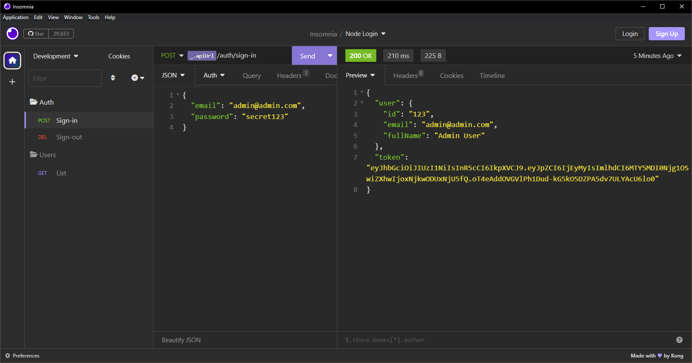

# Node Login

Projeto exemplo de login com Node.js e JWT.

Com este projeto você poderá criar um sistema de login com Node.js e JWT, utilizando qualquer banco de dados como banco de dados.

Ele foi desenvolvido para o conteúdo da [Master Class #21](https://www.youtube.com/watch?v=xxx) da [Dev Samurai](https://devsamurai.com.br).



## Como executar

Clone  o projeto na sua pasta de desenvolvimento:

```sh
git clone git@github.com:DevSamurai/node-login.git
```

E acesse a pasta do projeto e execute o seguinte comando:

```sh
cd node-login
docker-compose up -d
npm install
npm run dev
```

Lembrando que para executar o projeto você precisa ter o Node.js instalado na sua máquina juntamente com o Docker.


## Referencias

- https://self-issued.info/docs/draft-ietf-oauth-json-web-token.html
- https://jwt.io/

## Como acompanhar o meu trabalho

Se você curtiu esse conteúdo, vai curtir também minha newsletter, inscreva-se em <https://st.devsamurai.com.br/f7tvr6rx/index.html>
